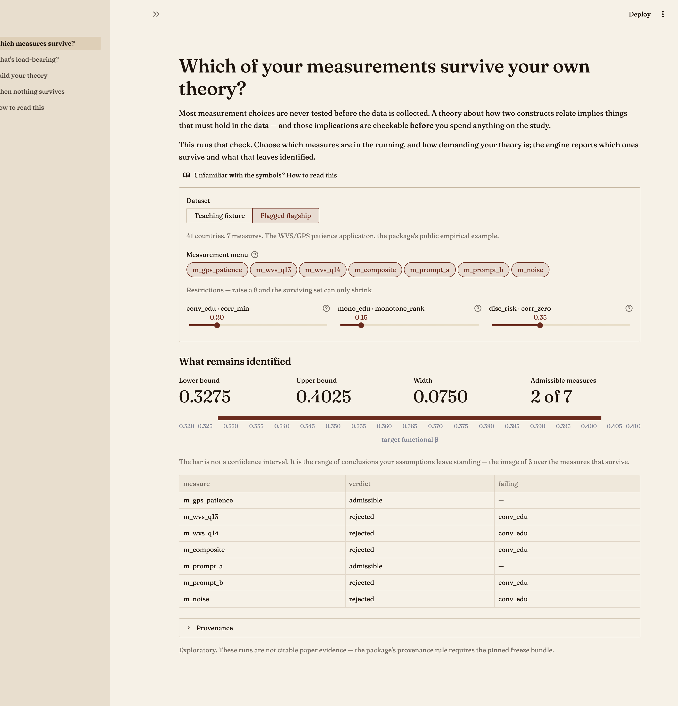
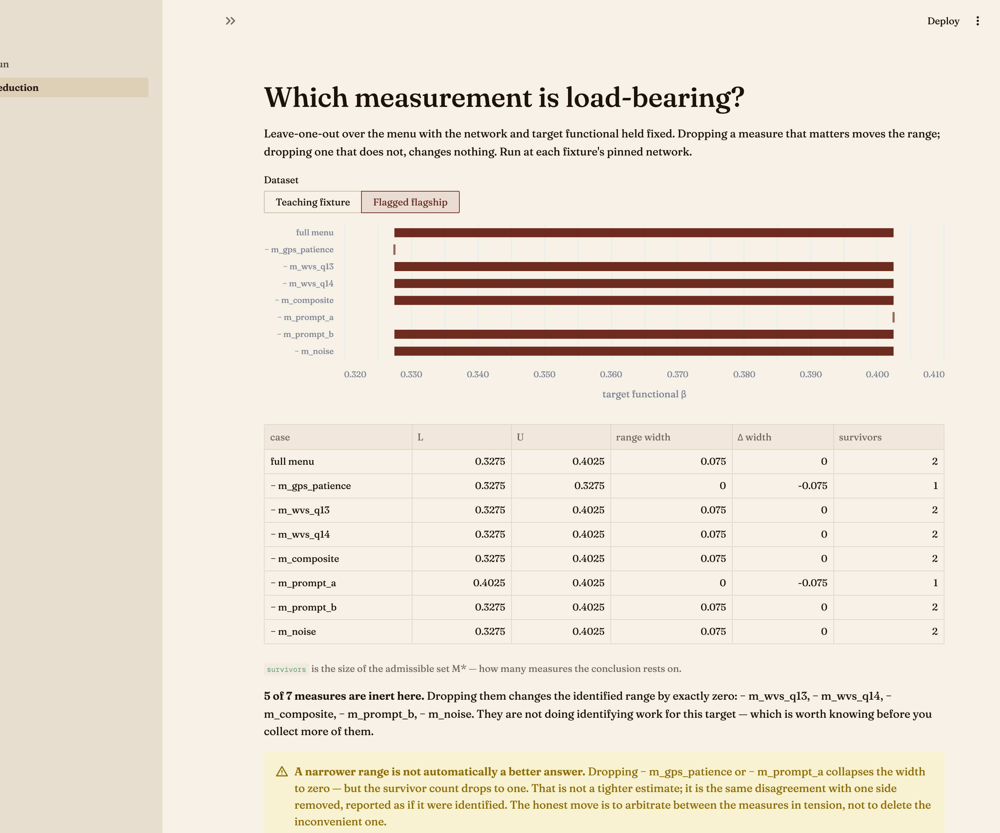

# cvprofiles — interactive demo

**Change the assumptions, watch the conclusion move.**

A thin Streamlit UI over the published [`cvprofiles`](https://pypi.org/project/cvprofiles/)
package. The engine is *never* reimplemented here — this project only stages validated
inputs, calls `run_profile`, and renders what comes back.

## Why it exists

`cvprofiles` answers a question most tooling skips: *given your theory's observable
implications, which of your measures is even entitled to the interpretation you want?*
The answer is a set (`M*`) and a range, not a star. That is hard to explain in prose and
obvious when someone moves a slider.

**Run** — menu and restriction θ as live controls:



**Reduction** — with the same fixture, five of seven measures turn out to be inert:




## Run it

```bash
uv venv .venv --python 3.11
uv pip install -e .
.venv/bin/streamlit run streamlit_app.py
```

Six screens. **Start here** is the front door: the claim, one live result, three
steps of how it works. The rest are named as questions rather than as tools.

| Route | Screen | What it shows |
|---|---|---|
| `/` | **Start here** | The claim, the stakes, and one result **computed live** from the real engine (never hand-typed, so it cannot drift). Three-step how-it-works. Links to the other screens. |
| `/run` | **Which measures survive?** | Menu + restriction θ as live controls. Reports the admissible set `M*`, the identified range `[L, U]`, and which restriction rejected each measure. |
| `/reduction` | **What's load-bearing?** | Leave-one-out over the menu. Shows which measures are load-bearing and which are inert. |
| `/build-network` | **Build your theory** | Author your own nomological network: change restriction types, re-point what each binds to, tighten θ. Teaches the trade — bind to an **auxiliary** column and the reduction curve survives; bind to a **measure** and it does not. |
| `/failure-mode` | **When nothing survives** | One slider: the tightness multiplier. Drive it far enough and every measure dies — the empty admissible set, shown as the finding it is. |
| `/method` | **How to read this** | What `M*`, `[L, U]`, θ and width mean, for a reader who has never seen the tool. |

The network builder is the pedagogical centrepiece. It deliberately lets the reader walk
into the structural trap (a restriction anchored to a measure) and then shows the engine
refusing, because that refusal is the thesis: the tool declines to guess.

### Feedback

Each page ends with a two-tier footer (`core/feedback.py`): one-click sentiment, plus an
optional note answering *"what are you trying to measure or decide?"* — the only kind of
feedback worth acting on.

**Nothing is stored inside the app.** Streamlit Community Cloud's filesystem is ephemeral,
so appending to a local file loses feedback on every restart. Set `FEEDBACK_ENDPOINT` (and
optionally `CONTACT_EMAIL`) in the app's secrets to POST somewhere real; with nothing
configured the form falls back to a `mailto:` link.

The default page lives at `/`; `url_path` on a `default=True` page does **not** create a
route. Now that `Overview` is the default, `Which measures survive?` is a normal page and
`/run` resolves — but if you ever make it default again, `/run` will 404 and you must use
`/`.

## Design notes

* **Theme lives in `.streamlit/config.toml`** — the site's own academic tokens (oxblood
  `#6b2c1f`, paper `#f6f1e7`, Fraunces). No custom CSS; `streamlit config show` confirms
  attribution.
* **Every engine call gets a fresh temp dir.** A reused `out_dir` silently unlinks the
  previous run's inference-layer artifacts. Temp dirs are removed after the summary is
  extracted.
* **Subsetting the menu changes the validated input, and therefore the `run_id`.** That is
  the provenance contract working, not a broken freeze.
* **The empty admissible set is a designed state, not an error.** The engine returns
  `empty=True` and exit 0 — "a finding, not a failure". The UI says so in words.
* **`RestrictError` is surfaced, not swallowed** — the engine refused the input rather
  than guessing, and the page explains which kind of binding caused it.
* Outputs are labelled **exploratory**. They are not citable paper evidence; the package's
  provenance rule requires the pinned freeze bundle.

## What the flagship actually shows

41 countries, 7 measures, WVS/GPS patience application:

* `[L, U] = [0.3275, 0.4025]`, width `0.0750`, `|M*| = 2`
* **Five of seven measures are inert** — dropping `m_wvs_q13`, `m_wvs_q14`, `m_composite`,
  `m_prompt_b`, or `m_noise` moves the range by exactly zero.
* The width comes entirely from two measures in tension: `m_gps_patience` (floor) and
  `m_prompt_a` (ceiling).
* Dropping *either* collapse the width to zero while `|M*|` falls to 1 — a **narrower
  range that is a worse answer**. The same disagreement with one side deleted.
* `wvs_gps` empties entirely at θ ≥ 0.6.

## Verifying changes

```bash
.venv/bin/python -m pytest tests/test_engine.py -q   # invariant suite over the engine wrapper
.venv/bin/python verify_app.py                       # AppTest: pages render, no exceptions
```

`tests/test_engine.py` pins the contracts the demo's credibility rests on: the advertised
headline is reproducible from the real engine, a menu subset is a different validated input
(different `run_id`), the same measures are load-bearing and inert every time, the empty
finding is reachable and is not an error, and the wrapper returns a structured error dict
instead of raising.

`verify_app.py` also hunts for empty-`M*` configurations, so the headline state stays
reachable.

Screenshots need care: Chrome's `--screenshot` fires before Streamlit's websocket delivers
the element tree, so it captures a bare skeleton. Use `cdp_shot.py`, which drives Chrome
over CDP and waits:

```bash
"/Applications/Google Chrome.app/Contents/MacOS/Google Chrome" --headless=new \
  --user-data-dir=/tmp/cdp-profile --remote-debugging-port=9222 about:blank &
.venv/bin/python cdp_shot.py "http://127.0.0.1:8507/" shots/run.png 15 1500
```

`--user-data-dir` is required: without it Chrome reuses a running instance and ignores
`--remote-debugging-port`.

## Deploying to Streamlit Community Cloud

1. <https://share.streamlit.io> → **New app** → **Deploy a public app from GitHub**
2. Repository `Bonorinoa/cvprofiles-demo`, branch `main`
3. Main file path: **`streamlit_app.py`**
4. Deploy. No secrets are required — the app reads only the fixture bundled in the repo
   (`data/wvs_gps/`) and the one shipped inside the `cvprofiles` wheel (`mini_v1`).

Verified from a clean clone: fresh `python 3.11` venv + `pip install -r requirements.txt`
→ `streamlit 1.63.0`, `cvprofiles 3.0.2`, both pages render with no exception.

Dependencies are pinned in `requirements.txt` (Streamlit Cloud reads this, not
`pyproject.toml`). Keep the `cvprofiles==3.0.2` pin — the demo's numbers are a property of
that release.
